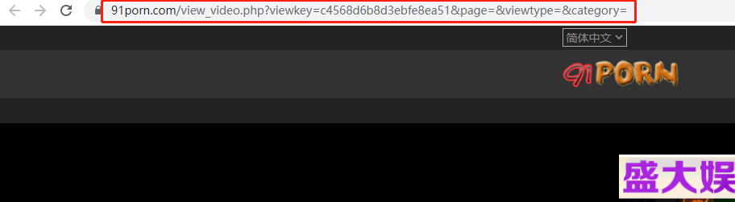
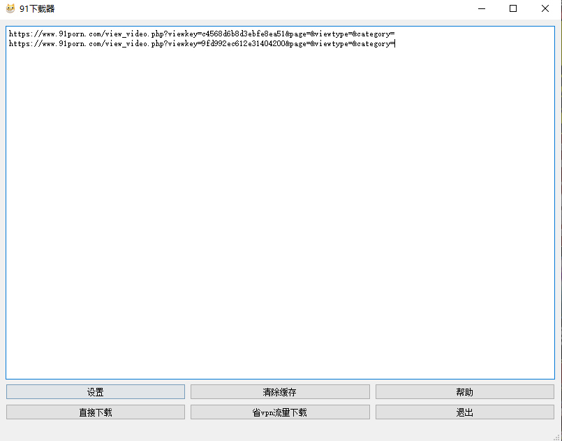
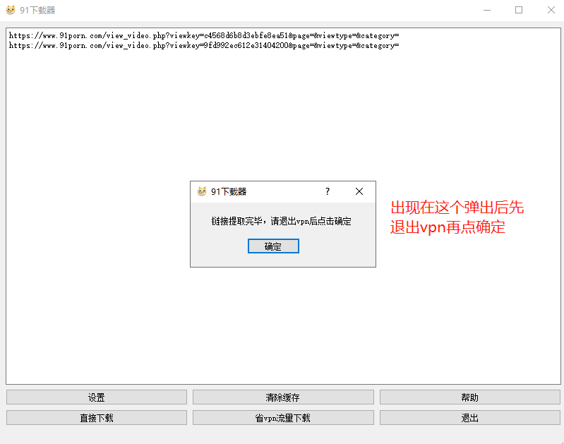
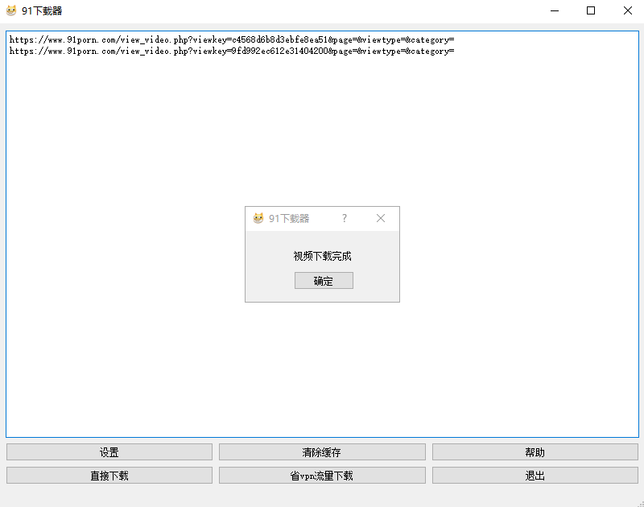

###91Porn爬虫
通过UI界面操作的91爬虫。易操作，没有下载数量限制，可多线程下载。

###环境要求
- python3.7
- nodejs
- ffmpeg

#### 使用说明

0.导入依赖包
 
`pip install -r requirements.txt`

1.运行start.py

2.打开vpn，打开91porn，打开几个你想下载的页面

3.在弹出的窗口中输入你想下载的连接，每个链接占一行

4.如果你vpn流量很多的话可以点直接下载，然后等待下载完毕就可以了。

5.如果想节省流量，点击节省流量下载。这时候会出现一个弹窗，先别急着点确定，先退出vpn，然后再点确定等待下载完毕

